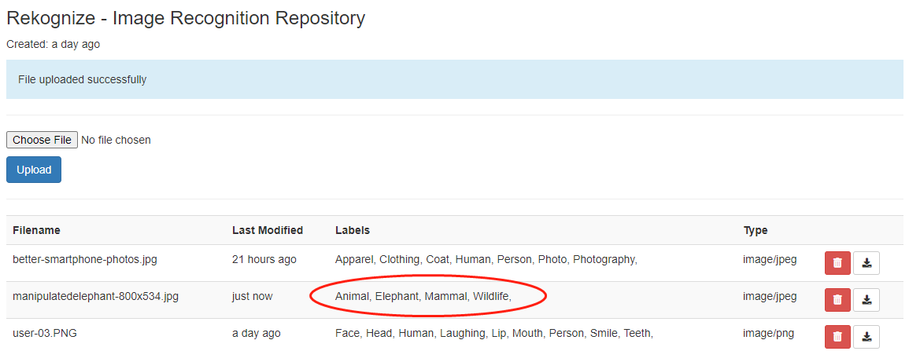

# Rekognize
<ul>
<li>Image repository featuring object analysis and identification.</li>
<li>Upload, download or delete image files.</li>
<li>Object labeling using AWS lambda serverless compute</li>
</ul>

## Screenshots
Uploaded image:

Image labels:

## Installation Instructions
#### For Windows:

In terminal:

`$ cd Rekognize`

`$ virtualenv venv`  

`$ venv\scripts\activate`

`$ pip install -r requirements.txt`

`$ py app.py`  

Go to http://127.0.0.1:5000/

#### For Mac OS:

In terminal:

`$ cd Rekognize`

`$ virtualenv venv`  

`$ source venv/bin/activate`

`$ pip install -r requirements.txt`

`$ python app.py`  

Go to http://127.0.0.1:5000/

## Tech used
<ul>
<li>Python</li>
<li>Flask</li>
<li>AWS S3</li>
<li>AWS Rekognition</li>
<li>AWS Lambda</li>
<li>AWS API Gateway</li>
</ul>

## To do
<ul>
<li>Search filter for images</li>
<li>Cache functionality for calculated image labels to store in DynamoDB to improve performance.</li>
<li>Go completely serverless</li>
</ul>